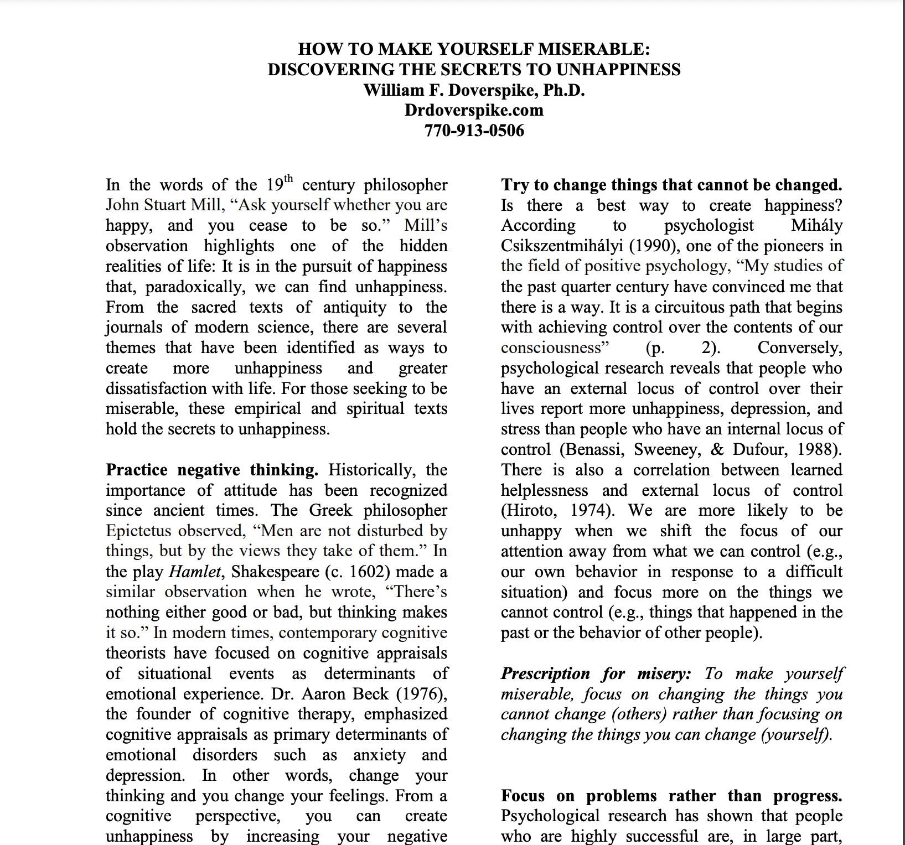
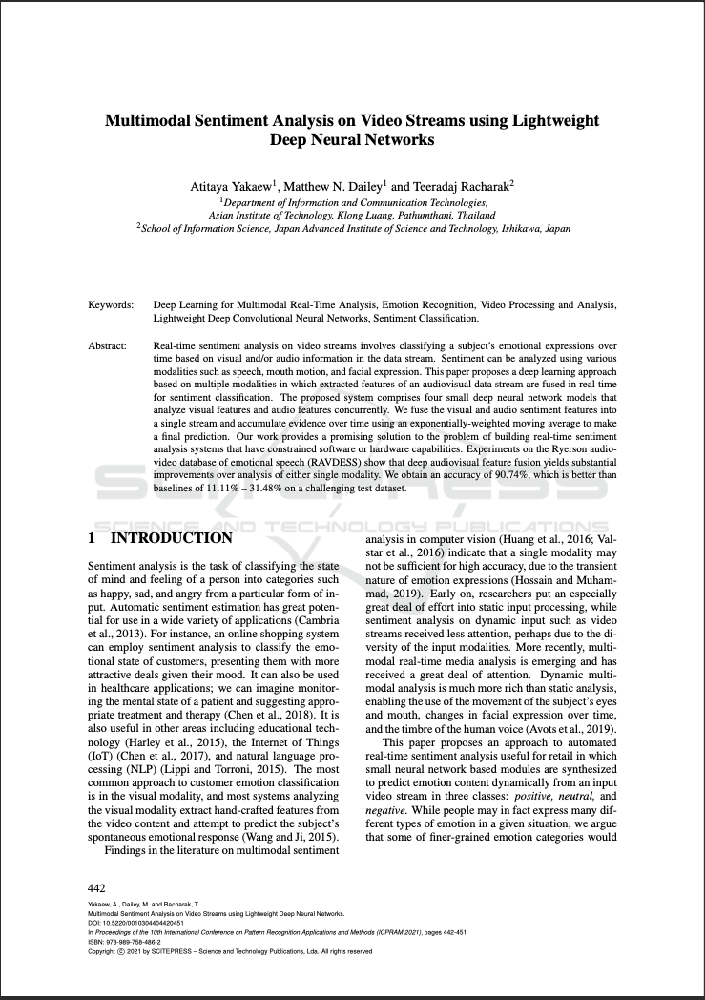

## How To Make Yourself Miserable:

  <!-- Left side: Image -->
  

    
  

  <!-- Right side: Text -->
  

  
DISCOVERING THE SECRETS TO UNHAPPINESS

William F. Doverspike, Ph.D.

Drdoverspike.com

  

---

## Multimodal Sentiment Analysis on Video Streams using Lightweight Deep Neural Networks

  <!-- Left side: Image -->
  

    
  

  <!-- Right side: Text -->
  

The paper introduces a real-time sentiment analysis system for video streams, aiming to classify emotional expressions using visual and audio information. The proposed approach employs four small deep neural network models analyzing visual and audio features simultaneously. The system fuses these features in real time, utilizing an exponentially-weighted moving average to accumulate evidence over time and make a final sentiment prediction. The method proves effective in overcoming constraints in software or hardware capabilities, showing substantial improvements over single-modality analysis in experiments using the RAVDESS database. The system achieves an impressive 90.74% accuracy, outperforming challenging test dataset baselines ranging from 11.11% to 31.48%

  

---
